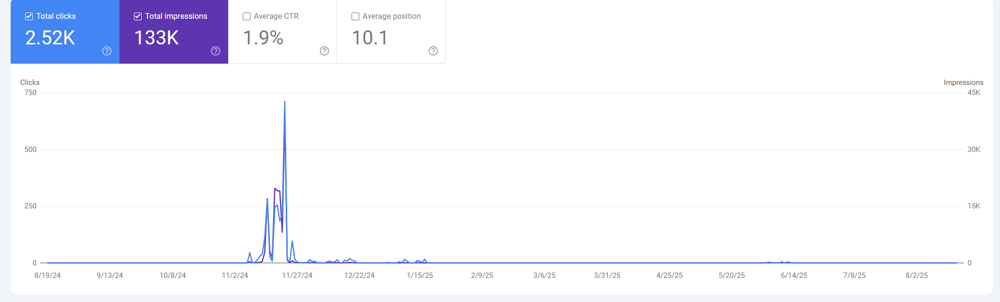

This takes heavy inspo from @quiteafancyemerald

## Intro: The Battle

SEO for an unblocked games site is more difficult than any other type of site.
You either A) choose keywords to rank for and get your site blocked by GoGuardian categorizer, or B) use keywords like g4m3s and get no users from Google.
However, this doesn't have to be the case. Smartly using canonical tags, multiple domains, and SEO tricks, we can get the best of both worlds!
Let's get right into it.

## Multiple Domains

Most likely your main site that you created first will get blocked. You may have made it look like a games site to blockers, or it got manually added by GoGuardian. So you decided to make more links, good (use .com .org .net don't use any others!). Now that the main site is blocked (or even if it isn't) you can use it as an SEO dummy. Have it rank for all the keywords and keep your main sites hidden (if you use the same repo for multiple links do).

```js
if (site == mainsite) return text;
else return keywordStrip(text);
```

This is a great way to keep the same repo while only having one site take the fall!

Also Have the secondary sites have canonical tags to your main so your main gets the benefits from the traffic of the secondary sites (blockers most likely dont look at the canonical tag)

```html
<link rel="canonical" href="mainsite/curpage" />
```

## Keywords

This is pretty easy. You want to use long tail SEO and fight for niche keywords. "Unblocked Games" is extremely competitive. How about "Unblocked Games for school chromebooks 2025"? That's better. New game came out (Snow Rider 3D)? Rank for that, it will help.


_This is an image of [my site's](https://duckmath.org) stats just for Snow Rider 3D_

Basically follow trends so you can rank for new keywords and try and go niche if possible.

## Extras

GSC, 301, and Sitemaps

To check stats like above, go to Google Search Console and add your site. Mess around with it, it's super cool!

If you change a page on your site (i.e. /g4m3s/ -> /games/) make sure to put a 301 redirect so Google doesn't get mad.
Google would try to go to the page, it would 404, and you would lose trust for your site.

Sitemaps aren't as important as much anymore, but I would do a sitemap for your games.
How I do it is pull all my games in and create a big sitemap for them and submit it to Google.

Example: https://duckmath.org/g/sitemap.xml

I hope this was helpful! If I learn anything new I'll add it here.
If I'm missing anything join the discord and ping me!
